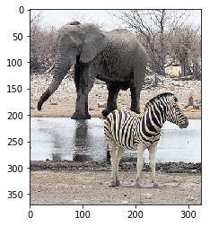
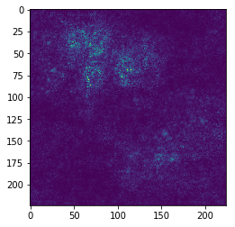
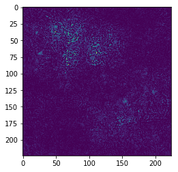
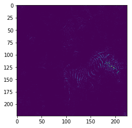
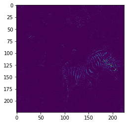
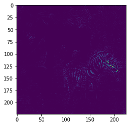

# Feedback Convolutional Neural Network for Visual Localization and Segmentation

The code is an implementation of Feedback Convolutional Neural Network for Visual Localization and Segmentation. The code is written in [PyTorch](https://pytorch.org/), very simple to understand.

There is also a [Caffe verion](https://github.com/caochunshui/FeedbackCNN-demo) of implementation, please check it if you use Caffe and Matlab.

### Requirement:
- Python 3
- Pytorch 0.4.0

### How to run:

open the ipython notebooks with `jupyter notebook`

then open `vgg_fr.ipynb` or `vgg_fsp.ipynb`, these are the two main files for demonstrate feedback idea.

### How it looks:

If you run `vgg_fsp.ipynb` without modification of code, you are supposed to see below visualization:

Input image:

Image gradient with respect to the target label:

Image gradient with respect to the target label after 4 iterations of feedback selective pruning (FSP):

   

### Files explanation:

- `vgg_fr.ipynb`: the main file that defines the vgg feedback network with the feedback recovering mechanism and run a feedback visualization on examplar images.
- `vgg_fsp.ipynb`: the main file that defines the vgg feedback network with the feedback selective pruning mechanism and run a feedback visualization on  examplar images.
- `images`: storing exmaplar images
- `imagenet1000_clsid_to_human.txt`: storing image net 1000 class names, for visualization and understanding purpose
- `test/simple_test.ipynb`: unit test for a simple feedback network, using a simple fully connected structure
- `test/vgg_test.ipynb`: unit test for the loading of a pretrained vgg network, then check the weights copying from pretrained network to a new defined network interface

### Citation

Please consider citing in your publications if it helps your research:

    @inproceedings{cao2015look,
      title={Look and think twice: Capturing top-down visual attention with feedback convolutional neural networks},
      author={Cao, Chunshui and Liu, Xianming and Yang, Yi and Yu, Yinan and Wang, Jiang and Wang, Zilei and Huang, Yongzhen and Wang, Liang and Huang, Chang and Xu, Wei and others},
      booktitle={Proceedings of the IEEE International Conference on Computer Vision},
      pages={2956--2964},
      year={2015}
    }
